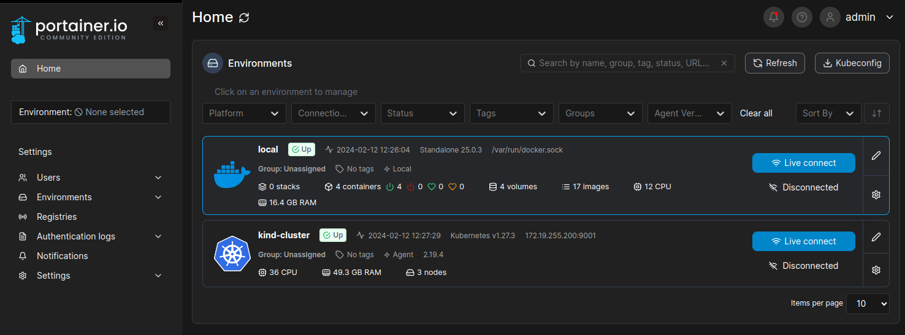

# Local Kubernetes cluster with kind

```
https://localhost:9443
```

Add a pass, for example: `LSvJz#5Q$hw!sY`

Using kubectl get the ip for the portainer service:

```bash
kubectl get services -n portainer
```

