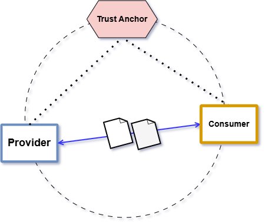

# Minimal Data Space Local - Kind Cluster

<!-- TABLE OF CONTENTS -->
<details>
  <summary>Table of Contents</summary>
  <ol>
    <li>
        <a href="#ds-operator-trust-anchor">DS Operator (Trust Anchor)</a>
    </li>
    <li>
        <a href="#example-of-use">Example of use</a>
    </li>
  </ol>
</details>

This example is based on the [FIWARE's local deployment](https://github.com/FIWARE/data-space-connector/blob/main/doc/deployment-integration/local-deployment/LOCAL.MD). The main difference is that we are using a Kind cluster (with 3 nodes) and Terraform to manage all the resources.

The following diagram shows the main blocks of the architecture of the minimal data space. This example is composed of the following blocks:

- **DS Operator (trust anchor)**: Trust Anchor that manages the issuers and credentials.
- **DS Connector A (provider)**: Entity that provides and consumes data from the data space.
- **DS Connector B (consumer)**: Entity that only consumes data from the data space.



> [!NOTE]
>
> See FIWARE [module](../../modules/fiware_ds_connector/) for more details.

## Deployment

```bash
make init_apply
```

To connect to the cluster, there are two options:

1. Using the `KUBECONFIG` variable:
  ```bash
  export KUBECONFIG=./cluster-config.yaml
  kubectl get pods --all-namespaces
  ```
2. Using the `--kubeconfig` flag:
  ```bash
  kubectl get nodes --kubeconfig ./cluster-config.yaml --all-namespaces
  ```
> [!WARNING]
>
> **Temporary Solution** Also to access to the different services, you need to add all domain names to your `/etc/hosts` file.
>
> 1. Check the Traefik IP address: 
>
> ```bash
> kubectl get services -n traefik-ingress --kubeconfig ./cluster-config.yaml
> NAME                        TYPE           CLUSTER-IP    EXTERNAL-IP      PORT(S)          AGE
> traefik-dashboard-service   LoadBalancer   10.96.97.1    172.18.255.201   8080:30137/TCP   10m
>traefik-web-service         LoadBalancer   10.96.72.80   172.18.255.200   80:31910/TCP     10m
> ```
>
> 2. Add the domain names to your `/etc/hosts` file:
>
> ```bash
> 172.18.255.200     did-helper.consumer-a.local
> 172.18.255.200     keycloak.consumer-a.local
> 172.18.255.200     til.ds-operator.local
> 172.18.255.200     tir.ds-operator.local
> 172.18.255.200     apisix-proxy.provider-a.local
> 172.18.255.200     apisix-api.provider-a.local
> 172.18.255.200     did-helper.provider-a.local
> 172.18.255.200     pap-odrl.provider-a.local
> 172.18.255.200     scorpio-broker.provider-a.local
> 172.18.255.200     tm-forum-api.provider-a.local
> 172.18.255.200     til.provider-a.local
> 172.18.255.200     vc-verifier.provider-a.local
> ```

## Cheetsheet

- Get the pods status:
```bash
watch kubectl get pods --context kind-minimal-dataspace-cluster --kubeconfig ./cluster-config.yaml --all-namespaces
```

```bash
watch kubectl get pods --context kind-minimal-dataspace-cluster --kubeconfig ./cluster-config.yaml -n provider-a
```

- Get all certificates:
```bash
  kubectl get cert --context kind-minimal-dataspace-cluster --kubeconfig ./cluster-config.yaml --all-namespaces
```

- Get all secrets:
```bash
  kubectl get secrets --context kind-minimal-dataspace-cluster --kubeconfig ./cluster-config.yaml --all-namespaces
```

- Get secrect content:
```bash
  kubectl get secret --context kind-minimal-dataspace-cluster --kubeconfig ./cluster-config.yaml -n <namespace_name> <secret_name> -o jsonpath="{.data['tls\.crt']}" | base64 --decode

  kubectl get secret --context kind-minimal-dataspace-cluster --kubeconfig ./cluster-config.yaml -n ds-operator mysql-database-secret -o json

  kubectl get secret --context kind-minimal-dataspace-cluster --kubeconfig ./cluster-config.yaml -n ds-operator mysql-database-secret -o jsonpath="{.data}" | jq

  kubectl get secret --context kind-minimal-dataspace-cluster --kubeconfig ./cluster-config.yaml -n ds-operator mysql-database-secret -o json | jq -r '.data | to_entries[] | .key + ": " + (.value | @base64d)'
```