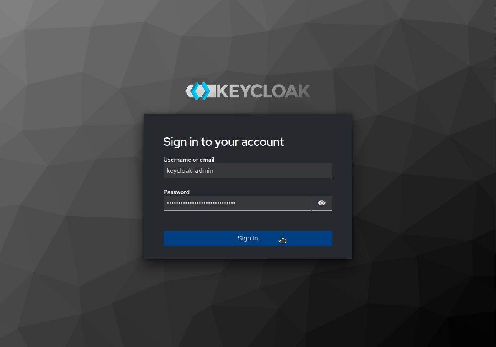
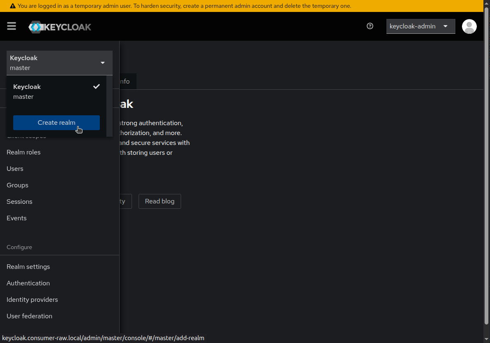
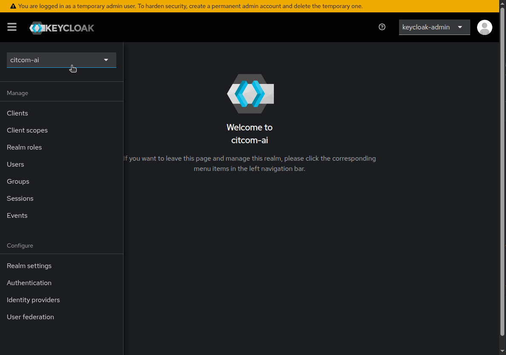
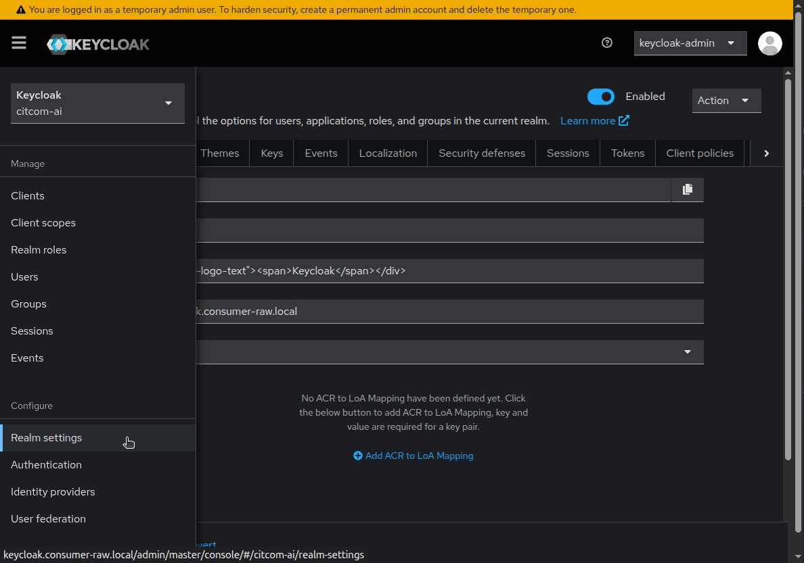
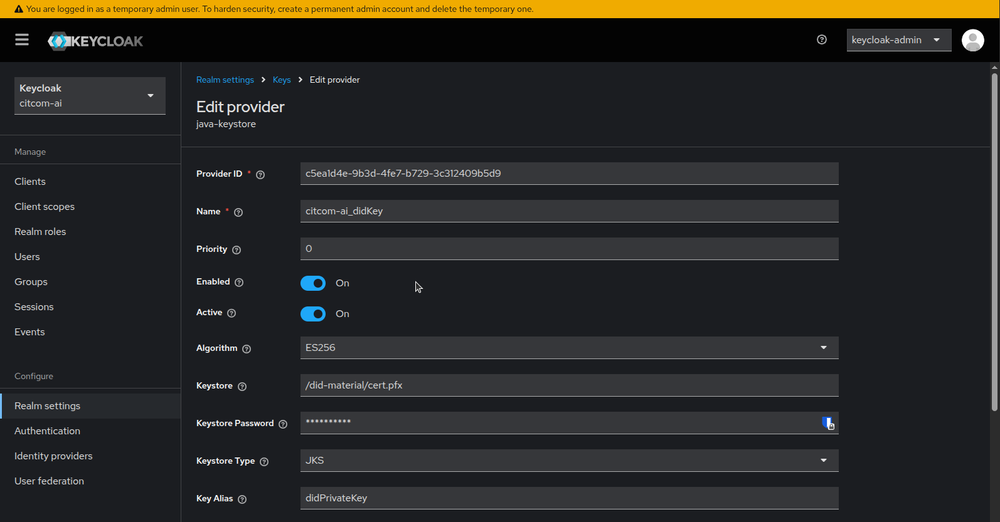

# Raw Fiware Components & Fiware Data Space Local Example

This example is a demonstration of how to deploy the Fiware Data Space Connector components without pre-configuration, alongside the pre-configured local data space connector example ([FIWARE's local deployment](https://github.com/FIWARE/data-space-connector/blob/main/doc/deployment-integration/local-deployment/LOCAL.MD)).

The entire deployment is performed on a Kind cluster (with 3 nodes), and Terraform is used to manage all resources. The goal is to show how to deploy the Fiware Data Space Connector components and how to interact with them.


## 1. Deployment ([_back to top_](#raw-fiware-components-fiware-data-space-local-example))

> [!NOTE]
>
> Check the permissions of the scripts:
>
> ```bash
> sudo chmod +x ../../modules/kind/metal_lb/scripts/get_ips.sh
> sudo chmod +x ../../modules/ca_configuration/scripts/generate_ca_certificates.sh
> ```

From `<repo_path>/examples/raw_fiware_components-ds_local` folder, you need to execute the following commands:

To deploy the minimal data space, you need to execute the following command:

```bash
make init_apply
```

> [!WARNING]
>
> The deployment time is around **14 minutes** (depending on the resources of your machine, this time can vary).


## 2. Services and Components ([_back to top_](#raw-fiware-components-fiware-data-space-local-example))

### Consumer Raw

Components deployed by the consumer:

- **DID-Helper**: Generates a did:key.
- **Issuance**: Generates keys for Keycloak.
- **Postgresql**: Database for Keycloak.
- **Keycloak**: Identity and Access Management (IAM) open-source tool. Only the did from the did-helper is imported; no realm is created.
- **Rainbow**: Data Space Protocol.

#### Keycloak

##### Obtaining the generated did:key

You can access the Keycloak container and view the `did.env` file, which contains the did:key generated by the did-helper.

```bash
kubectl exec -it keycloak-0 -n consumer-raw -- bash
```

Inside the container `keycloak@keycloak-0:/$`:

```bash
cat /did-material/did.env

DID=did:key:zDnaeSwnupmLVfbuU6vwpiUBSwgjDuVon1f7u6i31f6v7VTfE
```

##### Keycloak web access:

Keycloak can be used to issue VerifiableCredentials for users or services, which will be utilized for authorization in other participants of the Data Space. It comes with 1 preconfigured user:

- The `keycloak-admin`: has a password generated during deployment, which can be retrieved using:

```bash
kubectl get secret -n consumer-raw -o json issuance-secret | jq '.data."keycloak-admin"' -r | base64 --decode
```

Returns a password in this format (the password excludes the `%`):

```bash
vSnzIa3jAc9hFS3RMNlNYtkbjFvyYb%
```



> [!NOTE]
>
> The `keycloak-admin` user is the only user who can access the Keycloak administration console. If you want to create a new user, you must create a new realm and a new client.

The Keycloak administration console is available at: http://keycloak.consumer-raw.local. Log in using the `keycloak-admin` and the generated password.

> [!NOTE]
> 
> You may need to add the Keycloak address to `/etc/hosts`:
>
> ```bash
> sudo echo "172.18.255.200 keycloak.consumer-raw.local" >> /etc/hosts
> ```

##### New Realm

To create a new realm, you can use the Keycloak administration console. The `keycloak-admin` user has the necessary permissions to create a new realm.

A realm is a isolated logical grouping of users, roles, and clients. 

Within a realm:

- Users and their credentials are managed.
- Clients are configured, which are applications that use Keycloak for authentication.
- Roles, groups, access policies, etc. are defined.
- Authentication and login flows can be customized (screens, MFA, etc.).
- Each realm is completely independent from others.

You can create a new realm by clicking on the "Add Realm" button in the Keycloak administration console.



Enter a name for the realm and click on "Create". The new realm will be created, and you can start configuring it. First, select the new realm from the dropdown menu in the top left corner of the Keycloak administration console.



###### Realm Settings - General

Configure the general settings for the realm:

| Realm Name | Display Name | HTML Display Name | Frontend URL | Require SSL | 
| --- | --- | --- | --- | --- |
| citcom-ai | Keycloak | `<div class="kc-logo-text"><span>Keycloak</span></div>`| http://keycloak.consumer-raw.local | None |



###### Realm Settings - Keys



Keystore (/did-material/cert.pfx) password can be retrieved using:

```bash
kubectl get secret -n consumer-raw -o json issuance-secret | jq '.data."store-pass"' -r | base64 --decode
```

##### New Client

For each provider that you want to connect to the Data Space, you need to create a new client in Keycloak. A client represents an application that uses Keycloak for authentication.

To create a new client, go to the "Clients" section in the Keycloak administration console and click on the "Create" button.


The DID of the client is the DID of the provider that you want to connect to the Data Space. Also you need to set the roles for the client. The roles are used to authorize the client to access the Data Space.

##### New Users

To create a new user, go to the "Users" section in the Keycloak administration console and click on the "Add User" button.

The users are the members of your organization that will access the Data Space.