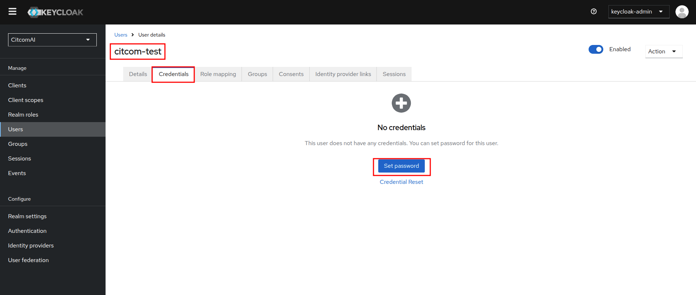
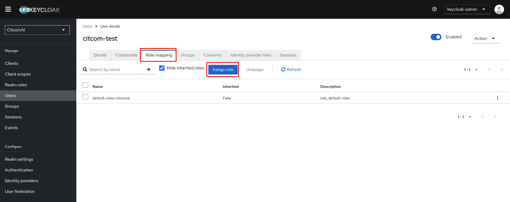
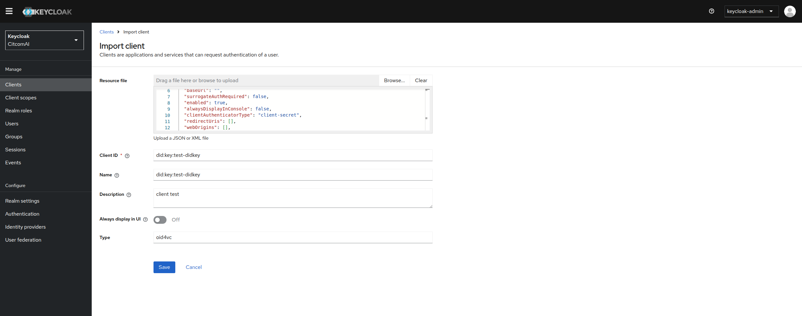
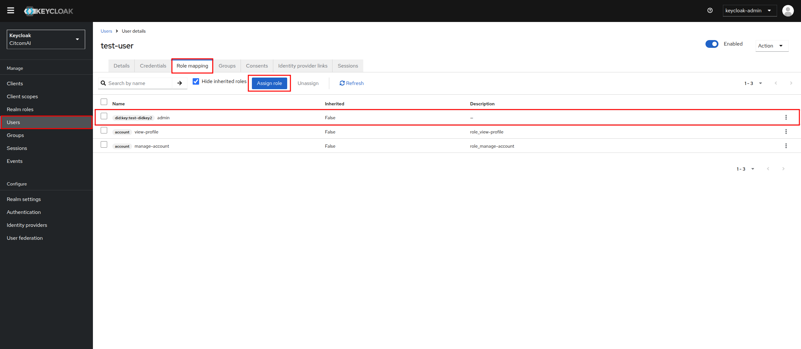

# Raw Fiware Components & Fiware Data Space Local Example

This example is a demonstration of how to deploy the Fiware Data Space Connector components without pre-configuration, alongside the pre-configured local data space connector example ([FIWARE's local deployment](https://github.com/FIWARE/data-space-connector/blob/main/doc/deployment-integration/local-deployment/LOCAL.MD)).

The entire deployment is performed on a Kind cluster (with 3 nodes), and Terraform is used to manage all resources. The goal is to show how to deploy the Fiware Data Space Connector components and how to interact with them.


**Table of Contents**

1. [Deployment](#1-deployment)
2. [Services and Components](#2-services-and-components)
    1. [Consumer Raw](#consumer-raw)
        1. [Keycloak](#keycloak)
            1. [Obtaining the generated did:key](#obtaining-the-generated-didkey)
            2. [Keycloak web access](#keycloak-web-access)
            3. [Realms](#realms)
                1. [From *json* file](#from-json-file)
                2. [From scratch](#from-scratch)
            4. [Clients](#clients)
            5. [Users](#users)

## 1. Deployment

> [!NOTE]
>
> Check the permissions of the scripts:
>
> ```bash
> sudo chmod +x ../../modules/kind/metal_lb/scripts/get_ips.sh
> sudo chmod +x ../../modules/ca_configuration/scripts/generate_ca_certificates.sh
> ```

From `<repo_path>/examples/raw_fiware_components-ds_local` folder, you need to execute the following commands:

To deploy the minimal data space, you need to execute the following command:

```bash
make init_apply
```

> [!WARNING]
>
> The deployment time is around **14 minutes** (depending on the resources of your machine, this time can vary).

<p align="right">(<a href="#raw-fiware-components--fiware-data-space-local-example">back to top</a>)</p>

## 2. Services and Components

### Consumer Raw

Components deployed by the consumer:

- **DID-Helper**: Generates a did:key.
- **Issuance**: Generates keys for Keycloak.
- **Postgresql**: Database for Keycloak.
- **Keycloak**: Identity and Access Management (IAM) open-source tool. Only the did from the did-helper is imported; no realm is created.
- **Rainbow**: Data Space Protocol.

#### Keycloak

##### Obtaining the generated did:key

You can access the Keycloak container and view the `did.env` file, which contains the did:key generated by the did-helper.

```bash
kubectl exec -it keycloak-0 -n consumer-raw -- bash
```

Inside the container `keycloak@keycloak-0:/$`:

```bash
cat /did-material/did.env

DID=did:key:zDnaeSwnupmLVfbuU6vwpiUBSwgjDuVon1f7u6i31f6v7VTfE
```

<p align="right">(<a href="#raw-fiware-components--fiware-data-space-local-example">back to top</a>)</p>

##### Keycloak web access

Keycloak can be used to issue VerifiableCredentials for users or services, which will be utilized for authorization in other participants of the Data Space. It comes with 1 preconfigured user:

- The `keycloak-admin`: has a password generated during deployment, which can be retrieved using:

```bash
kubectl get secret -n consumer-raw -o json issuance-secret | jq '.data."keycloak-admin"' -r | base64 --decode
```

Returns a password in this format (the password excludes the `%`):

```bash
vSnzIa3jAc9hFS3RMNlNYtkbjFvyYb%
```


> [!NOTE]
>
> The `keycloak-admin` user is the only user who can access the Keycloak administration console. If you want to create a new user, you must create a new realm and a new client.

The Keycloak administration console is available at: http://keycloak.consumer-raw.local. Log in using the `keycloak-admin` and the generated password.

> [!NOTE]
> 
> You may need to add the Keycloak address to `/etc/hosts`:
>
> ```bash
> sudo echo "172.18.255.200 keycloak.consumer-raw.local" >> /etc/hosts
> ```

<p align="right">(<a href="#raw-fiware-components--fiware-data-space-local-example">back to top</a>)</p>

##### Realms

A realm is a isolated logical grouping of users, roles, and clients. 

Within a realm:

- Users and their credentials are managed.
- Clients are configured, which are applications that use Keycloak for authentication.
- Roles, groups, access policies, etc. are defined.
- Authentication and login flows can be customized (screens, MFA, etc.).
- Each realm is completely independent from others.

To create a new realm, you can use the Keycloak administration console by clicking on the "Add Realm" button. The `keycloak-admin` user has the necessary permissions to create a new realm.


###### From *json* file

The realm configuration is provided in the [default_config_all-realm.json](./default_config_all-realm.json) file. This file contains the necessary configuration for the Keycloak **realm**, including **clients**, **roles**, and **users**.

>[!WARNING]
>
> Before importing the realm, ensure that:
> - you changed the did:key values in the `default_config_all-realm.json` file to match the did:key generated by the did-helper. You can find the did in the [did.env](#obtaining-the-generated-didkey) file inside the Keycloak container.
> - you changed the pkcs12 password in the `default_config_all-realm.json` file to match the one used in cert.pfx generation. You can find the password executing the command in the 'Realm Settings - Key'.

**Initialize json realm file**: 

```shell
cp template.default_config_all-realm.json default_config_all-realm.json
sed -i "s/{{ISSUER-DID}}/$(kubectl exec keycloak-0 -c keycloak -n consumer-raw -- cat /did-material/did.env | cut -d= -f2 | xargs)/g" default_config_all-realm.json
sed -i "s/{{STORE-PASS}}/$(kubectl get secret -n consumer-raw -o json issuance-secret | jq '.data."store-pass"' -r | base64 --decode)/g" default_config_all-realm.json
```


**Values to change** in the `default_config_all-realm.json` file:

Replace with the correct **consumer did-key** generated by the *did-helper*:

- **attributes** > `issuerDid`:
    ```json
    ...
    "attributes": {
            "frontendUrl": "http://keycloak.consumer-raw.local",
            "issuerDid": "did:key:zDnaeSwnupmLVfbuU6vwpiUBSwgjDuVon1f7u6i31f6v7VTfE"
        }
    ...
    ```
- **components** > `org.keycloak.keys.KeyProvider` > `config` >`kid`:
    ```json
    ...
    "components": {
        "org.keycloak.keys.KeyProvider": [
            {
                ...
                "config": {
                    ...
                    "kid": [
                        "did:key:zDnaeSwnupmLVfbuU6vwpiUBSwgjDuVon1f7u6i31f6v7VTfE"
                    ],
                    ...
                }
            }
        ]
        ...
    }
    ...
    ```
- **components** > `org.keycloak.protocol.oid4vc.issuance.signing.VerifiableCredentialsSigningService` > `config` > `keyId` and `issuerDid`:
    ```json
    ...
    "components": {
        ...
        "org.keycloak.protocol.oid4vc.issuance.signing.VerifiableCredentialsSigningService": [
            {
                ...
                "config": {
                    "keyId": [
                        "did:key:zDnaeSwnupmLVfbuU6vwpiUBSwgjDuVon1f7u6i31f6v7VTfE"
                    ],
                    ...
                    "issuerDid": [
                        "did:key:zDnaeSwnupmLVfbuU6vwpiUBSwgjDuVon1f7u6i31f6v7VTfE"
                    ],
                    ...
                }
            }
        ]
        ...
    }
    ...
    ```

Replace with the correct **provider did-key** generated by the *did-helper*:

- **clients** > `clientId`:
    ```json
    ...
    "clients": [
        {   
            "clientId": "did:key:zDnaeud7zQitUYp1MxZyRGSuweXfDXGdu6hbYpKvrM6Ws1Eva",
            ...
        }
    ]
    ...
    ```
- **clients** > `protocolMappers` > `config` > `clientId`:
    ```json
    ...
    "clients": [
        {   
            "protocolMappers": [
                {
                    "config": {
                        ...
                        "clientId": "did:key:zDnaeud7zQitUYp1MxZyRGSuweXfDXGdu6hbYpKvrM6Ws1Eva",
                        ...
                    }
                }
                ...
            ],
            ...
        }
    ]
    ...
    ```
- **roles** > `client`:
    ```json
    ...
    "roles": {
        ...
        "client": {
            "did:key:zDnaeud7zQitUYp1MxZyRGSuweXfDXGdu6hbYpKvrM6Ws1Eva": [
                ...
            ]
        }
    },
    ...
    ```
- **users** > `clientRoles`:
    ```json
    ...
    "users": [
        {
            ...
            "clientRoles": {
                "did:key:zDnaeud7zQitUYp1MxZyRGSuweXfDXGdu6hbYpKvrM6Ws1Eva": [
                    "OPERATOR"
                ],
                ...
            },
            ...
        }
    ],
    ...
    ```

<p align="right">(<a href="#raw-fiware-components--fiware-data-space-local-example">back to top</a>)</p>

###### From scratch

Enter a name for the realm and click on "Create". The new realm will be created, and you can start configuring it. First, select the new realm from the dropdown menu in the top left corner of the Keycloak administration console.


**Realm Settings - General**

Configure the general settings for the realm:

| Realm Name | Display Name | HTML Display Name | Frontend URL | Require SSL | 
| --- | --- | --- | --- | --- |
| citcom-ai | Keycloak | `<div class="kc-logo-text"><span>Keycloak</span></div>`| http://keycloak.consumer-raw.local | None |


**Realm Settings - Keys**


Keystore (/did-material/cert.pfx) password can be retrieved using:

```bash
kubectl get secret -n consumer-raw -o json issuance-secret | jq '.data."store-pass"' -r | base64 --decode
```

<p align="right">(<a href="#raw-fiware-components--fiware-data-space-local-example">back to top</a>)</p>

##### Clients

For each provider that you want to connect to the Data Space, you need to create a new client in Keycloak. A client represents an application that uses Keycloak for authentication.

To create a new client, go to the "Clients" section in the Keycloak administration console and click on the "Create" button.


The DID of the client is the DID of the provider that you want to connect to the Data Space. Also you need to set the roles for the client. The roles are used to authorize the client to access the Data Space.

<p align="right">(<a href="#raw-fiware-components--fiware-data-space-local-example">back to top</a>)</p>

##### Users

To create a new user, go to the "Users" section in the Keycloak administration console and click on the "Add User" button.

The users are the members of your organization that will access the Data Space.


Fill username and email:


Set password for your new user. You can set a temporal or permanent password. 


Assign client roles to new user:


In this case we are filtering roles and selecting OPERATOR role:


<p align="right">(<a href="#raw-fiware-components--fiware-data-space-local-example">back to top</a>)</p>

###### Generate Verifiable Credential for new user
 
**Generate UserCredential**

Get an AccessToken from Keycloak:

```shell
export ACCESS_TOKEN=$(curl -s -X POST http://keycloak.consumer-raw.local/realms/CitcomAI/protocol/openid-connect/token \
--header 'Accept: */*' \
--header 'Content-Type: application/x-www-form-urlencoded' \
--data grant_type=password \
--data client_id=admin-cli \
--data username=citcom-test \
--data password=citcom-test \
--data scope='openid'| jq '.access_token' -r); echo ${ACCESS_TOKEN}
```
Get a credential offer uri(for the `user-credential), using the retrieved AccessToken:

```shell
export OFFER_URI=$(curl -s -X GET 'http://keycloak.consumer-raw.local/realms/CitcomAI/protocol/oid4vc/credential-offer-uri?credential_configuration_id=user-credential' --header "Authorization: Bearer ${ACCESS_TOKEN}" | jq '"\(.issuer)\(.nonce)"' -r); echo ${OFFER_URI}
```

Use the offer uri(e.g. the issuer and nonce fields), to retrieve the actual offer:

```shell
export PRE_AUTHORIZED_CODE=$(curl -s -X GET ${OFFER_URI} \
--header "Authorization: Bearer ${ACCESS_TOKEN}" | jq '.grants."urn:ietf:params:oauth:grant-type:pre-authorized_code"."pre-authorized_code"' -r); echo ${PRE_AUTHORIZED_CODE}
```

Exchange the pre-authorized code from the offer with an AccessToken at the authorization server:

```shell
export CREDENTIAL_ACCESS_TOKEN=$(curl -s -X POST http://keycloak.consumer-raw.local/realms/CitcomAI/protocol/openid-connect/token \
--header 'Accept: */*' \
--header 'Content-Type: application/x-www-form-urlencoded' \
--data grant_type=urn:ietf:params:oauth:grant-type:pre-authorized_code \
--data pre-authorized_code=${PRE_AUTHORIZED_CODE} | jq '.access_token' -r); echo ${CREDENTIAL_ACCESS_TOKEN}
```
Use the returned access token to get the actual credential:

```shell
export VERIFIABLE_CREDENTIAL=$(curl -s -X POST http://keycloak.consumer-raw.local/realms/CitcomAI/protocol/oid4vc/credential \
--header 'Accept: */*' \
--header 'Content-Type: application/json' \
--header "Authorization: Bearer ${CREDENTIAL_ACCESS_TOKEN}" \
--data '{"credential_identifier":"user-credential", "format":"jwt_vc"}' | jq '.credential' -r); echo ${VERIFIABLE_CREDENTIAL}
```

You will receive a jwt-encoded credential to be used within the data space.

Decoded jwt credential for citcom-test user example:
```json
{
  "nbf": 1752477064,
  "jti": "urn:uuid:cc974c65-b99c-4a92-9279-b01717e85a0b",
  "iss": "did:key:zDnaeomDNv18fjUmK6pgfL5fpAkE1LyfHo1oJb6yG6Z7Sf9ft",
  "vc": {
    "type": [
      "UserCredential"
    ],
    "issuer": "did:key:zDnaeomDNv18fjUmK6pgfL5fpAkE1LyfHo1oJb6yG6Z7Sf9ft",
    "issuanceDate": 1752477064.948,
    "credentialSubject": {
      "firstName": "Citcom",
      "lastName": "Test",
      "email": "citcom-test@example.com"
    },
    "@context": [
      "https://www.w3.org/2018/credentials/v1",
      "https://www.w3.org/ns/credentials/v1"
    ]
  }
}
```

**Generate OperatorCredential**

Get an AccessToken from Keycloak:

```shell
export ACCESS_TOKEN=$(curl -s -X POST http://keycloak.consumer-raw.local/realms/CitcomAI/protocol/openid-connect/token \
--header 'Accept: */*' \
--header 'Content-Type: application/x-www-form-urlencoded' \
--data grant_type=password \
--data client_id=admin-cli \
--data username=citcom-test \
--data password=citcom-test \
--data scope='openid'| jq '.access_token' -r); echo ${ACCESS_TOKEN}
```
Get a credential offer uri(for the `operator-credential), using the retrieved AccessToken:

```shell
export OFFER_URI=$(curl -s -X GET 'http://keycloak.consumer-raw.local/realms/CitcomAI/protocol/oid4vc/credential-offer-uri?credential_configuration_id=operator-credential' --header "Authorization: Bearer ${ACCESS_TOKEN}" | jq '"\(.issuer)\(.nonce)"' -r); echo ${OFFER_URI}
```

Use the offer uri(e.g. the issuer and nonce fields), to retrieve the actual offer:

```shell
export PRE_AUTHORIZED_CODE=$(curl -s -X GET ${OFFER_URI} \
--header "Authorization: Bearer ${ACCESS_TOKEN}" | jq '.grants."urn:ietf:params:oauth:grant-type:pre-authorized_code"."pre-authorized_code"' -r); echo ${PRE_AUTHORIZED_CODE}
```

Exchange the pre-authorized code from the offer with an AccessToken at the authorization server:

```shell
export CREDENTIAL_ACCESS_TOKEN=$(curl -s -X POST http://keycloak.consumer-raw.local/realms/CitcomAI/protocol/openid-connect/token \
--header 'Accept: */*' \
--header 'Content-Type: application/x-www-form-urlencoded' \
--data grant_type=urn:ietf:params:oauth:grant-type:pre-authorized_code \
--data pre-authorized_code=${PRE_AUTHORIZED_CODE} | jq '.access_token' -r); echo ${CREDENTIAL_ACCESS_TOKEN}
```

Use the returned access token to get the actual credential:

```shell
export VERIFIABLE_CREDENTIAL=$(curl -s -X POST http://keycloak.consumer-raw.local/realms/CitcomAI/protocol/oid4vc/credential \
--header 'Accept: */*' \
--header 'Content-Type: application/json' \
--header "Authorization: Bearer ${CREDENTIAL_ACCESS_TOKEN}" \
--data '{"credential_identifier":"operator-credential", "format":"jwt_vc"}' | jq '.credential' -r); echo ${VERIFIABLE_CREDENTIAL}
```

You will receive a jwt-encoded credential to be used within the data space.

Decoded jwt credential for citcom-test user example:
```json
{
  "nbf": 1752560178,
  "jti": "urn:uuid:adfa1e98-28d0-4a6f-8a53-d9c6f0294ca4",
  "iss": "did:key:zDnaeomDNv18fjUmK6pgfL5fpAkE1LyfHo1oJb6yG6Z7Sf9ft",
  "vc": {
    "type": [
      "OperatorCredential"
    ],
    "issuer": "did:key:zDnaeomDNv18fjUmK6pgfL5fpAkE1LyfHo1oJb6yG6Z7Sf9ft",
    "issuanceDate": 1752560178.136,
    "credentialSubject": {
      "firstName": "Citcom",
      "lastName": "Test",
      "roles": [
        {
          "names": [
            "OPERATOR"
          ],
          "target": "did:key:zDnaeud7zQitUYp1MxZyRGSuweXfDXGdu6hbYpKvrM6Ws1Eva"
        }
      ],
      "email": "citcom-test@example.com"
    },
    "@context": [
      "https://www.w3.org/2018/credentials/v1",
      "https://www.w3.org/ns/credentials/v1"
    ]
  }
}
```

###### Register new Provider as client

Each new provider in the data space has to be instantiated in the verifiable credentials issuer (Keycloak) as a `client`.

Currently, it is not possible to fully configure a client for the issuance of Verifiable Credentials via the Keycloak graphical interface. To achieve this, we will leverage the client import functionality and complete the necessary information.

1. Instantiate the JSON file to be imported from `template.client_import.json`
    ```shell
    cp template.client_import.json client_import.json
    sed -i "s/{{PROVIDER-DID}}/<fillme>/g" client_import.json
    ```
2. Define the types of Verifiable Credentials to be issued.

    ```json
    "attributes": {
      ...
      "vc.verifiable-credential.format": "jwt_vc",
      "vc.verifiable-credential.scope": "VerifiableCredential"
    },
    ```
   In the code snippet above, a type of Verifiable Credential named *VerifiableCredential* is defined.

   Additional credential types can be defined following the same structure:

    ```json
    "vc.operator-credential.format": "jwt_vc",
    "vc.operator-credential.scope": "OperatorCredential"
    ```

   The above example defines a credential type named *OperatorCredential*.

3. Adjust the information to be included in the VC JWT via mappers.

    ```json
    {
    ...
    "protocolMappers": [
      {
      "name": "first-name",
      "protocol": "oid4vc",
      "protocolMapper": "oid4vc-user-attribute-mapper",
      "consentRequired": false,
      "config": {
        "subjectProperty": "firstName",
        "userAttribute": "firstName",
        "aggregateAttributes": "false"
       }
      },
      {
      "name": "target-role-mapper",
      "protocol": "oid4vc",
      "protocolMapper": "oid4vc-target-role-mapper",
      "consentRequired": false,
      "config": {
        "subjectProperty": "roles",
        "clientId": "{{PROVIDER-DID}}",
        "supportedCredentialTypes": "VerifiableCredential"
        }
      },
      {
      "name": "context-mapper",
      "protocol": "oid4vc",
      "protocolMapper": "oid4vc-context-mapper",
      "consentRequired": false,
      "config": {
        "context": "https://www.w3.org/2018/credentials/v1",
        "supportedCredentialTypes": "VerifiableCredential"
        }
      }    
    ],
    ...
    }
    ```

   The mappers allow us to configure the information that will be added to the `credentialSubject` of the generated Verifiable Credential.

   In the example provided, the following mappers have been created:
    - `first-name`: adds the user's *firstName* field to the `credentialSubject`
    - `target-role-mapper`: adds the user’s roles for the client with ID `PROVIDER_IR`
    - `context-mapper`: adds the static context with the specified value.

   For each mapper, a list of `supportedCredentialTypes` is specified, indicating the credential types for which this mapper should be applied.

   Example of the generated `credentialSubject`:

    ```json
    "credentialSubject": {
      "firstName": "Citcom",
      "lastName": "Test",
      "roles": [
        {
          "names": [
            "OPERATOR"
          ],
          "target": "did:key:zDnaeud7zQitUYp1MxZyRGSuweXfDXGdu6hbYpKvrM6Ws1Eva"
        }
      ],
      "email": "citcom-test@example.com"
    }
    ```

4. Import client into Keycloak

   Navigate to *Clients* > Click the *Import client* button  
   

   Click *Browse* > Select the `client_import.json` file

   

5. Define *client_roles*

   

6. Assign *client_role* to a user

   

7. Generate a VerifiableCredential 

    Get an AccessToken from Keycloak:
    
    ```shell
    export ACCESS_TOKEN=$(curl -s -X POST http://keycloak.consumer-raw.local/realms/CitcomAI/protocol/openid-connect/token \
    --header 'Accept: */*' \
    --header 'Content-Type: application/x-www-form-urlencoded' \
    --data grant_type=password \
    --data client_id=admin-cli \
    --data username=test-user \
    --data password=test \
    --data scope='openid'| jq '.access_token' -r); echo ${ACCESS_TOKEN}
    ```
    Get a credential offer uri(for the `verifiable-credential), using the retrieved AccessToken:
    
    ```shell
    export OFFER_URI=$(curl -s -X GET 'http://keycloak.consumer-raw.local/realms/CitcomAI/protocol/oid4vc/credential-offer-uri?credential_configuration_id=verifiable-credential' --header "Authorization: Bearer ${ACCESS_TOKEN}" | jq '"\(.issuer)\(.nonce)"' -r); echo ${OFFER_URI}
    ```
    
    Use the offer uri(e.g. the issuer and nonce fields), to retrieve the actual offer:
    
    ```shell
    export PRE_AUTHORIZED_CODE=$(curl -s -X GET ${OFFER_URI} \
    --header "Authorization: Bearer ${ACCESS_TOKEN}" | jq '.grants."urn:ietf:params:oauth:grant-type:pre-authorized_code"."pre-authorized_code"' -r); echo ${PRE_AUTHORIZED_CODE}
    ```
    
    Exchange the pre-authorized code from the offer with an AccessToken at the authorization server:
    
    ```shell
    export CREDENTIAL_ACCESS_TOKEN=$(curl -s -X POST http://keycloak.consumer-raw.local/realms/CitcomAI/protocol/openid-connect/token \
    --header 'Accept: */*' \
    --header 'Content-Type: application/x-www-form-urlencoded' \
    --data grant_type=urn:ietf:params:oauth:grant-type:pre-authorized_code \
    --data pre-authorized_code=${PRE_AUTHORIZED_CODE} | jq '.access_token' -r); echo ${CREDENTIAL_ACCESS_TOKEN}
    ```
    
    Use the returned access token to get the actual credential:
    
    ```shell
    export VERIFIABLE_CREDENTIAL=$(curl -s -X POST http://keycloak.consumer-raw.local/realms/CitcomAI/protocol/oid4vc/credential \
    --header 'Accept: */*' \
    --header 'Content-Type: application/json' \
    --header "Authorization: Bearer ${CREDENTIAL_ACCESS_TOKEN}" \
    --data '{"credential_identifier":"verifiable-credential", "format":"jwt_vc"}' | jq '.credential' -r); echo ${VERIFIABLE_CREDENTIAL}
    ```
    
    You will receive a jwt-encoded credential to be used within the data space.
    
    Decoded jwt credential for citcom-test user example:
    ```json
    {
      "nbf": 1752560178,
      "jti": "urn:uuid:adfa1e98-28d0-4a6f-8a53-d9c6f0294ca4",
      "iss": "did:key:zDnaeomDNv18fjUmK6pgfL5fpAkE1LyfHo1oJb6yG6Z7Sf9ft",
      "vc": {
        "type": [
          "OperatorCredential"
        ],
        "issuer": "did:key:zDnaeomDNv18fjUmK6pgfL5fpAkE1LyfHo1oJb6yG6Z7Sf9ft",
        "issuanceDate": 1752560178.136,
        "credentialSubject": {
          "firstName": "Citcom",
          "lastName": "Test",
          "roles": [
            {
              "names": [
                "OPERATOR"
              ],
              "target": "did:key:zDnaeud7zQitUYp1MxZyRGSuweXfDXGdu6hbYpKvrM6Ws1Eva"
            }
          ],
          "email": "citcom-test@example.com"
        },
        "@context": [
          "https://www.w3.org/2018/credentials/v1",
          "https://www.w3.org/ns/credentials/v1"
        ]
      }
    }
    ```

<p align="right">(<a href="#raw-fiware-components--fiware-data-space-local-example">back to top</a>)</p>